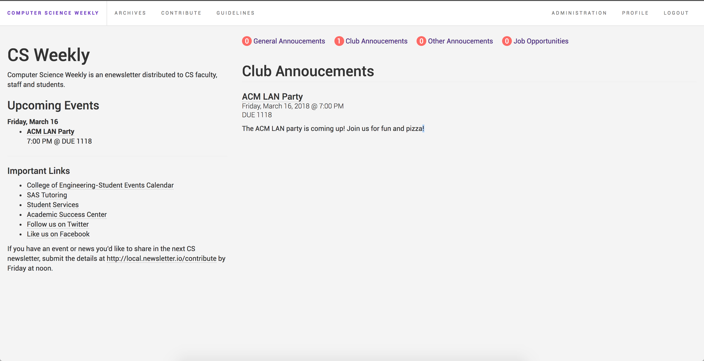
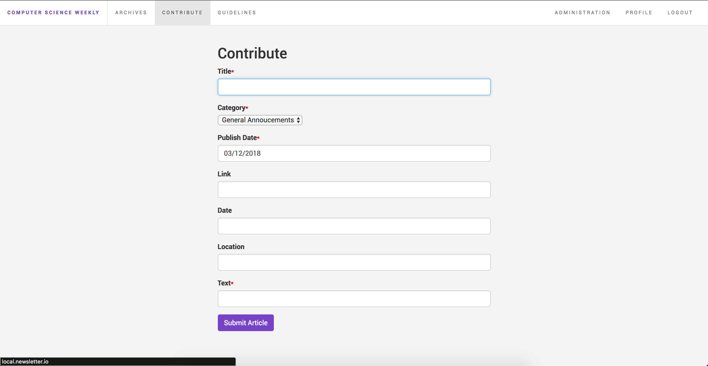
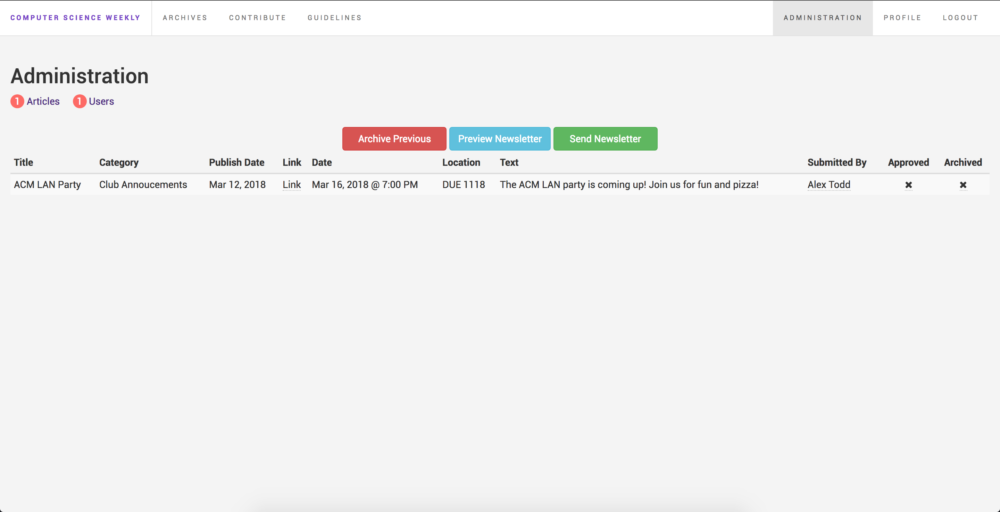
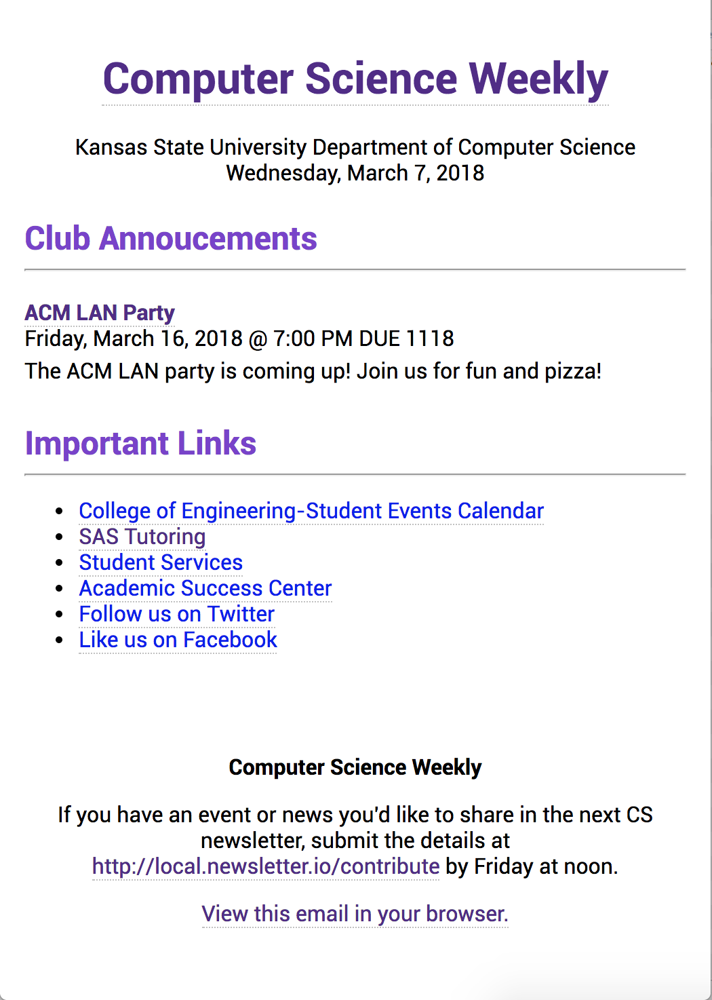

# Newsletter Generator

This newsletter generator runs on Laravel and allows anyone with a K-State login to submit articles for a weekly newsletter. Articles must be manually reviewed (for filtering purposes), but once accepted are automatically added into the newsletter which can be sent at the click of a button.

For articles that need to be run multiple weeks, someone will have to re-submit and approve the article every week.

## Installation

1. Clone the repo to your web server and setup your apache/nginx configuration to point to the public folder.

2. Navigate to the repos root folder and run `composer install`.

3. Copy `.env.example` to `.env` and run `php artisan key:generate`.

4. Edit the `.env` file and add your APP_URL, LISTSERV_EMAIL, database, mail, and CAS information.

5. Run `php artisan migrate` and `php artisan db:seed`.

6. Run `php artisan passport:install`.

6. Start submitting news!

## Screenshots
Homepage - shows this weeks news.

News Submission Page - Allows users to submit news.

Administration Page - Admins can approve articles and manage users.

Newsletter Preview - Administrators can preview the newsletter before sending it out.

